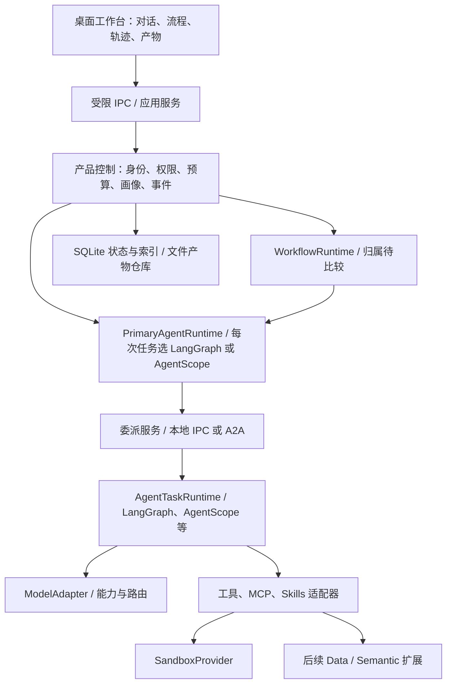

# 整体架构与职责边界

[返回设计入口](../00-discovery-summary.md) · 详细路线从[内核选型](02-kernel-selection.md)开始。

日期：2026-09-25；状态：候选方案。研发顺序以双主智能体验证为先；桌面外壳、工作流调度实现和数据组件仍需评审。

## 系统如何连接

桌面 renderer 不持有密钥和容器管理权限；Python runtime 管理执行。应用服务负责参数校验、事件订阅、取消、授权与产物访问。模型连接经受控出口，跨服务外发重新匹配授权。

## 哪些组件现在定，哪些稍后定

| 部分 | 本轮建议 | 详细依据 / 仍需验证 |
| --- | --- | --- |
| Agent 与流程 | 两种主智能体绑定 + 独立评审工作流调度归属 + 委派服务 | [双主选型](02-kernel-selection.md)、[多内核与 A2A](08-runtime-interoperability.md)；原生状态不承诺互转 |
| 统一协议 | 产品自有模型与端口 | [核心对象](03-core-contracts.md) |
| 流程与轨迹 UI | React/TypeScript；React Flow 候选 | [执行与交互](04-workflow-and-trace.md)；可视编辑尚未实测 |
| 桌面外壳 | Electron 候选，Tauri 保留 | [平台证据](../research/03-desktop-and-delivery.md)；打包、资源和三系统安装 |
| 本地状态 | SQLite + 不可变文件产物 | profile/event/checkpoint 分责；迁移和异常恢复尚需验收 |
| 代码隔离 | 本地 OCI 后端候选 | [沙盒](05-sandbox.md)；默认后端待安装与隔离实验 |
| 长期画像 | 版本化记录与可撤销行为偏好 | [画像](06-profile-memory.md) |
| Data 扩展 | DuckDB、ECharts、TanStack Table 候选 | [BI 证据](../research/02-bi-and-analysis.md)；D1 才建立完整下钻链条 |
| 后续扩展 | 语义层 MCP、远程 MCP、TTS、深度研究 | 只预留明确端口；见[故事](../product/02-user-stories.md) |

这张图表示逻辑责任，不要求拆成大量微服务。个人版本优先一个受控本地 runtime，隔离执行放独立后端。真实应用目录仍保留边界说明，方案批准后再按垂直功能建立模块。
