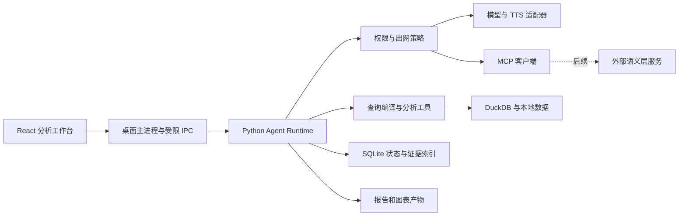

# 候选技术路线 v0.1

日期：2026-09-24。状态：`proposed`，等待用户评审。本文件是综合设计建议，已证实的上游事实及源码证据见 [内核研究](../research/01-agent-kernels.md)、[BI 研究](../research/02-bi-and-analysis.md)、[桌面研究](../research/03-desktop-and-delivery.md)。

## 1. 推荐先验证的组合

**Electron + React + TypeScript 桌面界面，Python 负责 Agent 与分析；LangGraph 管理持久执行，DuckDB 负责本地查询，ECharts + TanStack Table 展示结果，SQLite 保存项目元数据与任务状态。**

这是一条适合当前个人开发投入的候选路线。推荐理由是前端交互与 Python 分析生态可各自使用成熟工具，同时通过稳定契约隔离。代价是两套语言与 Python 分发。性能、安装体积和三系统兼容性仍要用原型测量。

| 部分 | 首选候选 | 备选与触发条件 |
| --- | --- | --- |
| 桌面外壳 | Electron | Tauri 2：若实测安装体积或常驻内存不满足目标，且愿意承担 Rust/WebView 差异 |
| 界面 | React + TypeScript | 不在研究期引入第二套 UI 框架 |
| Agent 执行 | Python + LangGraph，业务工具与策略自有 | PydanticAI/其他薄 SDK 可用于模型适配；先验证再决定，避免双重编排 |
| 模型接口 | 统一业务接口 + 供应商适配器 | OpenAI-compatible 仅是一类适配器，不假设全部模型行为相同 |
| 数据计算 | DuckDB + 有类型的分析函数 | Polars/Pandas 按具体算法增量引入；不同时维护多套默认查询引擎 |
| 可视化 | ECharts + TanStack Table | Perspective 用于专门的交互透视需求；Graphic Walker 先确认适配成本和品牌许可 |
| 流程 | 初期模板/节点列表；后续 React Flow 编辑 | 不在 MVP 同时运行 Temporal 与 LangGraph 两套状态控制 |
| 存储 | 文件/Parquet + DuckDB；SQLite 元数据/检查点 | 持久表、检查点、运行事件分库或明确表边界；原始业务文件不进入 Git |
| 扩展 | 独立 MCP client、Skills loader、Memory service | 语义层仅是未来 MCP/适配器，不建设本体服务 |
| 语音 | TTS provider 接口 | 具体服务按中文效果、成本和隐私选，STT 不包含在当前承诺中 |

## 2. 不把开源 Agent 整仓当产品内核

DSH/Hermes 等项目可以提供工具循环、上下文管理、权限、子 Agent、技能与记忆的设计参考。业务数据产品还需要指标口径、可验证查询、图表契约、数据版本和分析验收；这些不能靠替换聊天界面获得。

建议选择一个持久执行底座，自己拥有业务契约与工具策略。是否引用代码必须按固定 commit 的实际许可证与 NOTICE 办理。Claude Code 的公开资料、SDK 可用性和核心实现的开放程度分别判断；不因存在 GitHub 仓库就假设能复制其内核。

## 3. 进程与信任边界

- renderer 只接触已校验的 IPC，不直接获得 Node、文件系统、凭据或任意 shell。
- 主进程管理 worker 的启动、取消、退出和系统凭据。默认优先父子进程 stdio/受控管道协议；若采用 loopback HTTP，需绑定回环、随机端口、会话令牌与来源验证，不能只依赖 localhost。
- IPC 用带版本的 JSON 消息与事件序号；大数据传结果引用、分页或 Arrow，不把整份表转成 JSON 在前端/模型间重复传输。
- 分析 worker 执行固定编译器和受审查函数；首个原型不开放任意模型 SQL/Python/shell。后续代码执行单独建设操作系统级隔离，不能把 subprocess 当沙箱。
- MCP 与 Skill 脚本是新的代码/数据来源。工具声明、read-only 标记、Skill 的 allowed-tools 都不能自行扩大授权。
- 授权的数据可以跨模型出口，但要匹配目的地、项目、字段和用途。授权失效后所有子 Agent 和 TTS 同时受约束。

## 4. 核心对象与契约

| 对象 | 至少包含 | 目的 |
| --- | --- | --- |
| DatasetSnapshot | 文件哈希、解析参数、schema、粒度、时区、版本、质量报告 | 明确计算用了哪份数据 |
| MetricDefinition | ID/版本、分子分母、聚合、币种、过滤、适用粒度、确认者 | 避免同名指标口径漂移 |
| QuerySpec | snapshot、metric_version、dimensions、filters、comparison、sort、limit | 模型/图表共用有类型的查询请求 |
| QueryResult | query_id、规范 SQL/参数、结果引用、行数、截断状态、时间、warnings | 图表、报告和复核共用结果 |
| ChartSpec | query_id、图形类型、字段映射、单位、允许下钻维度、筛选上下文 | 不接受任意 HTML/JS 作为图表定义 |
| Evidence | 来源定位、snapshot/query_id、数值/观察、生成方法、时间、限制 | 每项主张都有可追溯依据 |
| AnalysisClaim | 结论、类别、evidence_ids、反例、缺失数据、适用条件 | 区分事实、假设与因果 |
| Run/Task | ID、parent、workflow_version、状态、budget、权限引用、checkpoint | 多 Agent 与恢复共享生命周期 |
| Artifact | 类型、内容哈希、来源 run、版本、输出路径、生成状态 | 产物不靠聊天文本临时拼接 |
| Grant | 项目、服务、工具/字段、动作、有效期、撤销状态 | 授权可复用且不能越界扩张 |

初版使用 Pydantic/JSON Schema 描述运行时契约，前端生成或验证相同结构；不要维护两套相互漂移的手工接口定义。这里是设计，尚未实现正式 schema。

## 5. Agent 运行过程

一个任务依次经过问题解析、范围确认、计划、受控工具执行、结果复核和产物生成。每步都可以返回“需要信息”“部分完成”“失败”“取消”，不能只有成功/失败两态。

外层工作流管理任务状态与检查点；节点内部 Agent 循环有最大轮数和工具预算。用户看到的是可执行计划、状态与证据，隐藏推理不写入日志。公开计划可以修改，修改后形成新版本，不篡改已经执行的历史。

长任务具备：

- 有效的 token/费用/时长/工具调用/并发上限；预算从父任务划分，子任务无权自增。
- 取消传播与 worker 超时终止；把“已要求取消”与“实际停止”分开。
- 检查点引用不可变数据版本；恢复时验证工具、流程和授权版本。
- 外部副作用先记意图和幂等键，再调用，最后记录结果；结果不确定时人工核对，不自动重试。
- LLM、查询结果缓存分别按模型/提示词/工具/数据/参数版本失效。

本轮 LangGraph 实验仅用于检查并行、暂停与恢复语义，不能代替以上全部产品逻辑。

## 6. 多 Agent 的使用范围

默认仍由一个协调 Agent 持有用户任务。复杂问题才拆独立子任务，例如数据质量检查和不同维度的贡献分析；简单汇总直接调用工具。

首版建议最多 2 个并行子任务。任务完成后交回结构化结果与证据引用，由复核步骤统一检查。角色是动态职责，不必永久驻留多个 Agent。

| 职责 | 可用工具 | 输出 | 限制 |
| --- | --- | --- | --- |
| 协调 | 元数据、计划、有限任务分派 | 任务计划、澄清项、结果整合 | 不能把权限转给子任务 |
| 数据检查 | schema、质量查询 | 质量发现和受影响范围 | 不擅自清洗或改业务口径 |
| 分析 | QuerySpec、已登记分析函数 | 贡献、趋势、候选解释 | 不执行自由文本代码 |
| 复核 | 结果/证据、重复计算 | 冲突、遗漏、边界与修正建议 | 模型同意不能代替数值校验 |

将同一原始表完整复制给每个 Agent 会增加外发和 token；优先传数据引用、已批准的 schema、摘要与结果。后续真实基线实验决定是否保留某个子 Agent。

## 7. 模型能力自适应

按 `provider + endpoint + model_id + revision` 记录能力：文字、图像、音频、工具调用、结构化输出、流式、上下文限制。每项保留声明来源、探测时间、验证状态（未知/通过/失败），允许用户覆盖。不能根据模型名字猜能力。

| 材料或能力缺口 | 候选处理 |
| --- | --- |
| CSV/XLSX/Parquet | 本地结构化读取，发已授权 schema/摘要；无需因为模型支持视觉就截图表格 |
| 图片/扫描页 | 有视觉能力则按授权发送；否则使用已配置 OCR，再告知识别局限 |
| 不支持工具调用 | 可尝试受限 JSON 计划 + schema 校验；失败则降为解释模式，不执行自由文本 |
| 不支持结构化输出 | 有限次数解析/修复；仍失败就停止相关步骤并报错 |
| 服务故障或能力变化 | 明确说明；仅在授权覆盖目标服务时切换，不能静默把数据发给新供应商 |

先验证一个服务端模型，并尽早用第二个实现探测适配边界。TTS 是独立服务适配，文字模型也能使用；视觉能力不决定是否可以播报。

## 8. Skills、MCP 和 Memory

**Skills**：兼容 SKILL.md 基础格式，先读取元信息，匹配后再加载正文和所需资源。保存来源、内容哈希和已启用版本。技能给出分析方法，所有工具仍经过同一权限校验。详见 [Agent Skills 规范](https://agentskills.io/specification)。

**MCP**：运行时作为 host/client。首期验证本地 stdio；远程 HTTP 与授权后续加入。锁定实际 SDK 与支持的协议版本，验证发现、调用、取消和错误。不要求一次实现全部协议能力。当前 `latest` 已指向 [2026-07-28 规范](https://modelcontextprotocol.io/specification/2026-07-28)，不能直接把旧教程代码当作当前兼容证明。

本轮补做的 [SP-08](../../research/spikes/mcp-local-contract/README.md) 已用 SDK 2.2.0 观测到该协议版本，完成同版本本地客户端与合成服务端测试；未覆盖旧版服务互操作。工具结果须按声明的输出类型校验，不能假定任意 dict 都自动提供结构化内容。

**Memory** 分为：

1. 会话状态：任务内需要的临时上下文，允许压缩但保留证据引用。
2. 项目记忆：用户确认的指标/术语/偏好，带来源、时间、状态、项目与版本。
3. 过程经验：被验证的分析方法，优先成为可审查的流程模板/Skill。

业务事实不得从“上次模型这样说”直接升级为长期知识。初期 SQLite 结构化表和检索即可；只有检索实验表明有需要再加向量索引。删除要涵盖源记录、摘要和派生索引；敏感记忆不跨项目。

## 9. BI 与 workflow 的边界

ECharts 提供图形能力；业务层维护筛选、钻取路径、指标聚合、版本与联动。点击图形会产生新的 QuerySpec，经本机查询后刷新，返回上一层则恢复旧的 QuerySpec。

React Flow 提供节点与连线编辑；执行器负责类型检查、参数绑定、依赖、重试、暂停和恢复。先让用户保存和复用一条经过验证的分析流程，再开放自由拖拽。流程图必须体现真实执行状态，不能把 UI 中的连线当成持久执行保证。

## 10. 语义层扩展点

将来可从 MCP 获取实体身份、指标定义、允许关联、约束及证据。适配器返回 `semantic_id + version + source + constraints + freshness`，映射到本地 MetricDefinition/QuerySpec。外部本体出现冲突、不可用或过期时，界面明确说明；不能覆盖用户已确认的本地口径而不留记录。

本轮不实现本体存储、构建、推理或语义服务。

## 11. 路线复审条件

- Python worker 的三系统打包无法达到可接受的安装体验，重新评估运行时与分发策略。
- Electron 在真实文件与图表场景的内存或体积不达标，做同任务 Tauri 对照后再决定。
- LangGraph 的恢复/事件模型与产品契约冲突，先写最小复现再判断替换，不靠增加第二套工作流引擎掩盖。
- 真实模型评测中多 Agent 未提高质量但显著增加成本，改为单 Agent + 确定性复核。
- 复杂透视交互成为主要需求，再评估 Perspective/Graphic Walker 或商业表格组件。
