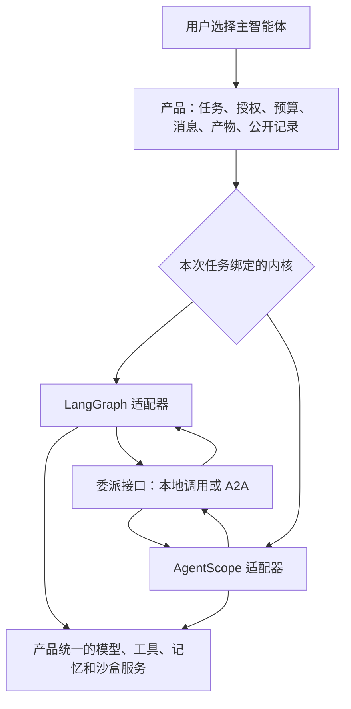

# 两种 Agent 内核怎样接入同一个产品

[阅读入口](../00-discovery-summary.md) · [产品目标](../product/01-product-brief.md) · [下一步验证](../engineering/01-development-process.md)

状态：设计候选，尚未实现。LangGraph 和 AgentScope 都要能担任主智能体；工作流调度方式还需实验和评审。

## 先看一次任务

用户选择 AgentScope 为主智能体，提交一段文字和一张图片。产品先保存任务和文件引用，再把它们交给 AgentScope 适配器。适配器把通用消息转成 AgentScope 能接收的格式；图片无法处理时必须说明原因。AgentScope 要调用工具，先向产品请求；产品检查权限和预算，再调用本地工具或 MCP 服务。

假如 AgentScope 把一项工作交给 LangGraph 子 Agent，委派接口记录父子任务的关系，再用 A2A 传送请求。两个框架产生的公开步骤都写入同一套任务记录。用户下次可以选择 LangGraph 作为主智能体；旧任务仍由原内核恢复，历史仍在同一工作台查看。现有实验只验证了 **LangGraph 主→AgentScope 子**，反方向和完整主任务切换还没有通过实验。

图中循环表示两种内核都能担任父或子，不表示两个框架直接读取对方的内部状态。

## 什么地方必须有转接口

这里的“每个点”指框架与产品交换数据、请求能力的地方，不是给框架内部的每个函数套一层。新增第三种内核时，要编写适配代码，把它的消息、工具调用和公开运行事件转换为产品统一的格式。某项能力做不到，就明确标为不支持，不向用户提供相应操作；能支持的能力则用同一套测试验证。界面和业务模块只读取产品保存的记录，不直接依赖某个框架的对象。

| 框架接触产品时 | 产品统一处理什么 | 框架适配器负责什么 |
| --- | --- | --- |
| 开始主任务或子任务 | 任务身份、运行版本、暂停和取消状态 | 启动、观察、恢复本框架的一次执行 |
| 收发文字、图片和结构化内容 | 有顺序的消息、文件引用、来源 | 双向转换内容；不能转换就明确报错 |
| 使用模型、工具、MCP 和 Skill | 模型配置、工具登记、权限、预算、Skill 版本 | 接入本框架的模型及工具调用方式 |
| 执行用户保存的流程 | 流程定义、节点身份、分支和审核记录 | 按选定调度路线执行节点，并报告可恢复位置 |
| 保存偏好、状态和公开轨迹 | 用户画像、历史、产物、公开事件 | 提交本框架可见事件，引用原生检查点 |
| 运行代码或委派别的 Agent | 沙盒策略、父子关系、传输和费用记录 | 经统一入口请求沙盒或 A2A，接收结果 |

[适配边界和失败处理](08-runtime-interoperability.md)逐项列出接口；[对象字段](03-core-contracts.md)是工程参考。产品保管授权、预算和事件库。内核适配器只能通过这些服务调用外部能力，换内核不会给它更多权限。

## 从 DeepSeek Harness 借鉴什么

[DeepSeek Harness 固定源码](../research/11-deepseek-harness-pluggability.md)展示了服务由插件提供、上层按服务接口调用的做法。它的主 Agent 工厂和工作流服务在同一 Context 中各只有一个实例；本项目还需要按**每次任务**选择主内核。这一部分要由自己的注册和绑定机制完成，不能把“有插件”直接当成“已支持双主内核”。

实现上，每个内核注册自己的名称、版本、可用接口和验证结果。任务开始时固定所选适配器；升级后重新验收。新增内核只接产品接口，不需要写 LangGraph↔AgentScope、AgentScope↔第三种内核这样的两两转换器。

## 还没有决定的事

用户保存的工作流可以由独立的产品调度层运行，也可以由两套内核各自的工作流适配器运行。两条路线都要保证 AgentScope 真正担任主智能体；不能把它藏在 LangGraph 父任务下面。下一步先验证 AgentScope 主任务和反向 A2A，再比较这两条路线的代码量、恢复行为和维护成本。[选型证据](02-kernel-selection.md)记录了当前已知的缺口。

桌面外壳、数据计算、图表和沙盒后端也仍是候选：[桌面证据](../research/03-desktop-and-delivery.md)、[BI 组件](../research/02-bi-and-analysis.md)、[沙盒设计](05-sandbox.md)。本页只说明内核与产品如何分工。
