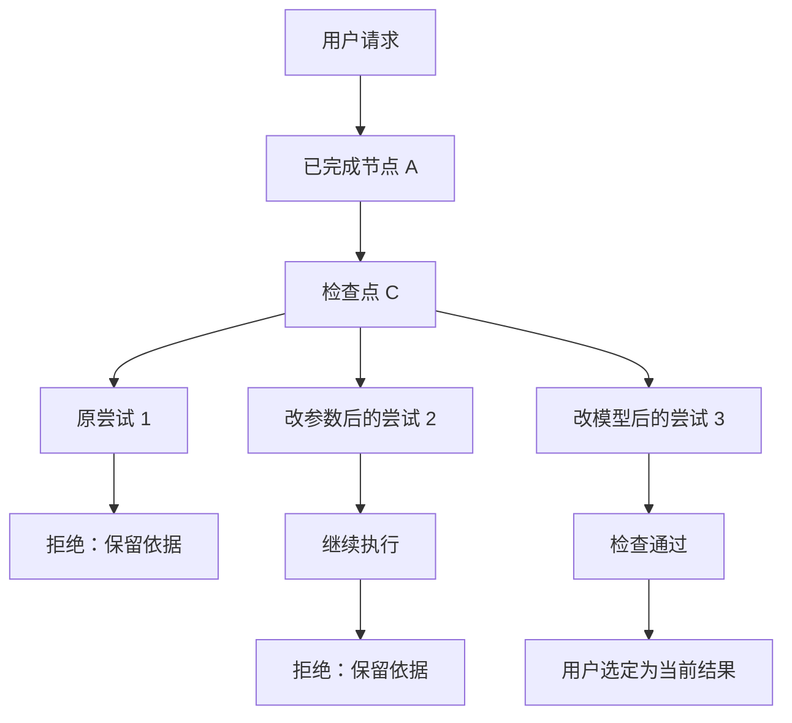

# 工作流、模型路由与执行轨迹

[返回设计入口](../00-discovery-summary.md) · 上一步：[核心对象](03-core-contracts.md) · 下一步：[执行沙盒](05-sandbox.md)

日期：2026-09-25；状态：待评审。流程执行、回溯语义和轨迹交互只在本页完整定义；字段见[核心对象](03-core-contracts.md)。

## 1. 用户如何固化成熟逻辑

工作流画布保存 WorkflowDefinition，不保存某次运行的临时状态。用户可从模板开始，连接节点、设置参数和模型策略、试跑，再保存新版本；Agent 可以提出草案，用户确认后成为可执行版本。运行中的旧版本不会随画布编辑改变。

建议 K1 提供 **有类型的 DAG 画布 + 受限 Agent 节点内部循环**。先不支持任意连线形成无限循环；循环需显式的次数、时间和退出条件。第一版画布支持增删节点、连线、参数编辑、校验、保存和试跑，不做多人协同编辑。

| 节点 | 用途 | 约束 |
| --- | --- | --- |
| Deterministic | 固定变换、校验、统计、模板填充 | 已登记函数；不调用模型 |
| Model | 提取、解释、生成结构化草案 | 固定输入/输出 schema 与模型策略 |
| Router | 在允许分支中选择 | 规则优先；模型只能输出枚举或 abstain |
| Tool / Sandbox | 调用登记工具或执行生成代码 | 授权、参数与沙盒能力检查在执行前完成 |
| Agent / Subworkflow | 有界多步任务或复用流程 | 独立上下文、预算和工具子集；子任务结果有来源 |
| Review | 人或可配置检查器接受/拒绝候选 | 拒绝依据可见；机器检查通过不等于业务判断正确 |
| Join | 合并并行结果 | 明确 all-required / 有标记的 partial；不能悄悄忽略失败 |
| Publish | 导出、写入或选定正式结果 | 使用 EffectIntent；候选结果不能越过选择与授权 |

编译时检查节点类型、引用是否存在、输入输出兼容、分支是否完备、循环是否有界、预算能否分配、工具/模型是否可用。用户编辑的是声明式参数；禁止把画布 JSON 当作可执行 Python/JS。

## 2. 小模型如何降成本

成熟计算步骤直接调用固定函数；只有需要语义判断的路由才调用小模型。可选路由例子是“直接回答 / 调用工具 / 交给视觉节点 / 升级模型 / 请求澄清”。可选项由流程定义，模型不能凭文本创造新工具或目的地。

一次路由保存模型、提示模板、允许分支、输出、校验结果和升级原因。schema 失败、任务不在支持域或关键检查不通过时，按流程升级或澄清。模型自报 confidence 不当作校准后的正确概率；阈值需要带标签的路由集验证。

每个模板比较三条基线：全用强模型、规则路由、规则+小模型。报告任务通过率、错误分流率、升级比例、token、实际账单/未知费率、P50/P95 延迟和失败样本。平均费用近似 `路由费用 + 各分支执行费用的加权和 + 重试/复核费用`；节省必须在相同验收门槛下计算。**本轮使用模拟模型，没有测出真实节省比例。**

预算在父 Run 内原子预留，再分给并发子任务；实际消耗结算、未用部分释放。重试、升级、TTS 和远程工具都计入相应预算。取消阻止新调度并通知在途任务；供应商已经收到的请求可能继续计费，需保留不确定状态。

## 3. 三种图各自表达什么

| 视图 | 表达什么 | 编辑是否影响历史 |
| --- | --- | --- |
| 流程定义图 | 接下来允许怎样运行 | 编辑创建新版本 |
| 本次执行图 | 实际执行的节点、并发、重试、子任务与结果 | 只追加事件 |
| 尝试分支树 | 从哪个历史状态产生新尝试、哪些候选被拒绝或选中 | 原分支保留，新分支有独立 run_id |

用户图片对应的候选尝试可以呈现如下；并行子 Agent 用另一种连线/分组标明，不能混成“回溯重跑”。

检查通过、选定结果、对外发布是三个独立状态。检查器可以自动给出 pass/reject，但不因此获得额外权限；被拒绝分支保留事件和证据，不写入正式结果或全局画像。

## 4. 点击历史节点后的操作

| 操作 | 实际行为 | 不应出现的误解 |
| --- | --- | --- |
| 查看记录 | 读取已保存的公开输入输出和产物 | 不发起模型或工具调用 |
| 回放记录 | 按事件顺序展示历史过程 | 不宣称重新算出了相同结果 |
| 重试失败节点 | 相同输入，新 attempt；先判断副作用状态 | “上次超时”不等于远端没执行 |
| 恢复暂停任务 | 从指定检查点继续，重查当前授权/预算 | 不把旧授权或旧密钥恢复为有效 |
| 从此处创建尝试 | 展示参数/模型差异，固定父检查点，新 branch 与 run，重算受影响后续节点 | 不覆盖原分支，也不自动撤销原副作用 |
| 选定结果 | 追加 selection 事件，更新当前选择指针 | 不删除失败分支或改写过去的状态 |

开始分叉前先取得稳定检查点；正在写入的分支需暂停或选择已完成检查点。输入、工具、模型或流程版本改变后，依赖它的下游结果失效；只有依赖完全相同的不可变产物才可显式复用。若用户修改检查点之前的输入，应回到该输入的第一个消费者之前重算，不能只改状态中的一个数字而沿用旧派生结果。

新尝试固定 workflow/model/tool/skill/profile 的版本引用。节点恢复以框架可用的检查点粒度为准；不承诺能从任意一行代码或任何 token 中间恢复。LangGraph 子图的内部回溯粒度还取决于检查点配置，尚需单独验证。[官方 time-travel 说明](https://docs.langchain.com/oss/python/langgraph/use-time-travel)

外部写入走 outbox/回执与接收方幂等键；接收方不支持去重且结果未知时停下核对。没有通用的“恰好一次”承诺。更换参数的新尝试通常是新 operation；重试同一个已获授权的操作才复用 operation_id。沙盒重跑规则见[执行沙盒](05-sandbox.md#5-审批重放和撤销)。

## 5. 全轨迹展示的内容和界面

主界面建议：左侧任务；中间对话；右侧默认产物，可切换“流程 / 轨迹”。轨迹面板有分支树、选中节点详情和两个尝试的对比，不要求用户在聊天记录里寻找每次工具调用。

节点详情按顺序显示：输入和版本 → 公开计划/路由选择 → 工具参数与返回 → 用户可见模型输出 → 产物/来源 → 耗时与费用 → 异常与重试 → 检查/选择记录。模型实际输入可作为受权限保护的记录查看，敏感内容在采集时处理；省略部分显示原因与受控引用。系统不采集或展示隐藏推理。

大文件只存 Artifact 引用；流式文字可分片呈现。事件先持久化再推给 UI，以 seq 断点续传、event_id 去重；断流不伪造完成。节点开始后进程退出会留下未完成 attempt，恢复时追加中止/恢复事件。框架回调只作为事件来源，产品事件库承担持久记录和权限控制。

画布选中的节点对应具体 attempt，而非含糊的“第三步”。并行结果展示各自时间段和 join 条件；未执行、跳过、失败、拒绝、取消、未知、通过和已选定分开显示。UI 可筛选隐藏某类事件，但原始公开轨迹不得无提示丢弃。

## 6. K1 的验收顺序

1. 固定图：工具→两个并行子任务→人工检查→产物；保存/关闭/新进程恢复。
2. 用户画布：改连线、参数和模型策略；非法连接被拒；旧运行仍指向旧版本。
3. 历史分叉：拒绝原尝试、从旧节点改输入重跑、比较并选定；原记录哈希不变。
4. 真实模型：小模型路由/升级、同一输入换模型、异常/预算/取消；记录质量与成本。
5. 故障注入：写入后崩溃、事件断流、子任务失败、授权撤销、模型超时。

现有实验覆盖固定图的部分机制，见[对照实验](../research/09-framework-comparison.md)。可视画布、真实多 Agent 质量、子图内部回溯、全树预算与 UI 仍未实现。
