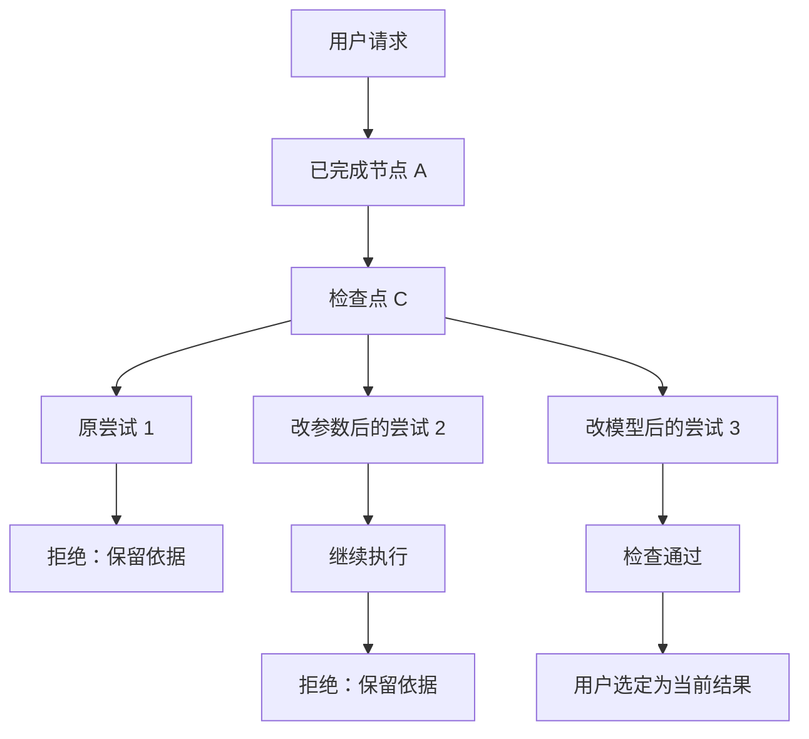

# 自主 Agent、Skill、确定性工作流与执行记录

[返回设计导航](../00-discovery-summary.md) · 相关：[多内核与 A2A](08-runtime-interoperability.md)

修订：2026-09-26；状态：需求澄清中。本页区分 Agent 自主执行、Skill 和确定性工作流，再说明运行记录怎样展示。画布和完整轨迹界面尚未实现；对象字段见[核心对象](03-core-contracts.md)。

## 先看懂这页

用户可以直接问：“这个月收入为什么下降？”主 Agent 先检查数据、决定查地区还是产品、调用工具，并在需要时委派子 Agent。用户可让它阅读一个分析 Skill，作为选择方法的参考；Agent 仍根据当前数据决定下一步，不按固定连线运行。

用户也可以事先编排一条**确定性工作流**，例如“核对字段 → 按已确认口径计算收入 → 把地区异常交给子 Agent 核查 → 人工复核”。用户在编排时指定主 Agent 及其内核；步骤、输入输出和分支条件随版本保存。主 Agent 可以依照流程派发子 Agent、接收结果。这里“确定性”指流程的步骤和允许的分支事先写明，不表示每一步都由固定程序完成。

以后还可以探索第三种用法：主 Agent 自主分析一段时间，发现某项计算适合标准化处理时，调用一条已登记的确定性工作流，拿到结果后继续分析。**这项混合调用只是后期候选，尚未决定具体实现和阶段。**

三种运行都应有公开执行记录。只有运行已保存的工作流时，才存在相应的流程定义图；自主任务也应能查看调用、产物、失败和子任务。本页第 1–2 节讨论方法与固定流程，第 3–5 节讨论记录、再试与界面，第 6 节列待验证事项。

## 1. 两种固化方法，各解决什么问题

| 固化方式 | 保存什么 | 运行时谁决定下一步 |
| --- | --- | --- |
| Skill | 分析方法、适用条件、说明和可选资源 | Agent 阅读后结合任务自行判断；Skill 不强制固定步骤 |
| 确定性工作流 | 主 Agent 选择、节点、连线、输入输出、分支条件和版本 | 主 Agent 按已保存规则推进，可派发子 Agent；模型只能在被允许的节点和选项内判断 |

自主 Agent 任务可以不依赖任何已保存的流程。用户创建这种任务时选择主 Agent 及其内核；LangGraph、AgentScope 都须能承担主任务。Skill 是供 Agent 参考的材料，不是可直接运行的流程定义，也不自动授予工具权限。

确定性工作流可以由用户单独启动。它的画布保存“下次怎样运行”的步骤和设置，不保存某次运行到一半的状态。用户可从模板开始，连接节点并设置参数；Agent 可以提出流程草案，但须经用户确认。编排时，用户指定主 Agent 及其内核，并为需要派发的子 Agent 指定职责、内核和输入。主 Agent 的选择随流程版本保存。运行前要核对流程所需的节点、模型、工具和权限；不兼容就解释原因。由产品还是所选内核调度固定节点，仍待[工作流路线实验](02-kernel-selection.md#3-独立固定流程的两条候选路线)决定；这项选择不应改变用户指定的主 Agent。

**待讨论的传统工作流范围：**候选画布是有类型的 DAG，可包含受限 Agent 节点。先不允许任意连线形成无限循环；循环需显式的次数、时间和退出条件。画布至少要能增删节点、连线、编辑参数、校验、保存和试跑。何时交付独立画布尚未确定，不把它作为自主 Agent 能运行的先决条件。

**后期混合调用要验证什么：**Agent 需要知道哪些流程可用、适用条件和输入类型，再决定是否调用。产品须检查它提交的输入、授权和流程版本；固定流程按自己的规则完成后，把产物或失败状态交还 Agent。用户应能看清公开的调用理由、输入、流程步骤和返回结果，不要求读取模型隐藏推理。调用的触发方式、失败后的继续策略和费用控制尚未定案；Skill 可以提供建议，但不能单靠一段说明绕过流程的输入与权限检查。

| 节点 | 用途 | 约束 |
| --- | --- | --- |
| Deterministic | 固定变换、校验、统计、模板填充 | 已登记函数；不调用模型 |
| Model | 提取、解释、生成结构化草案 | 固定输入/输出 schema 与模型策略 |
| Router | 在允许分支中选择 | 规则优先；模型只能输出枚举或 abstain |
| Tool / Sandbox | 调用登记工具或执行生成代码 | 授权、参数与沙盒能力检查在执行前完成 |
| Agent / Subworkflow | 有界多步任务或复用流程，可选择不同内核 | 受管理节点有独立上下文、预算和工具子集；外部节点按服务能力与授权接入；声明必要能力；跨内核规则见[专页](08-runtime-interoperability.md) |
| Review | 人或可配置检查器接受/拒绝候选 | 拒绝依据可见；机器检查通过不等于业务判断正确 |
| Join | 合并并行结果 | 明确 all-required / 有标记的 partial；不能悄悄忽略失败 |
| Publish | 导出、写入或选定正式结果 | 使用 EffectIntent；候选结果不能越过选择与授权 |

编译固定流程时，检查节点类型、引用是否存在、输入输出兼容、分支是否完备、循环是否有界、预算能否分配、工具/模型是否可用。用户编辑的是声明式参数；禁止把画布 JSON 当作可执行 Python/JS。

## 2. 固定流程里怎样使用小模型

在确定性工作流中，成熟计算步骤直接调用固定函数；只有需要语义判断的路由才调用小模型。可选路由例子是“直接回答 / 调用工具 / 交给视觉节点 / 升级模型 / 请求澄清”。可选项由流程定义，模型不能凭文本创造新工具或目的地。自主 Agent 的动态决策不因此变成一个预先画好的路由节点。

一次路由保存模型、提示模板、允许分支、输出、校验结果和升级原因。schema 失败、任务不在支持域或关键检查不通过时，按流程升级或澄清。模型自报 confidence 不当作校准后的正确概率；阈值需要带标签的路由集验证。

每个模板比较三条基线：全用强模型、规则路由、规则+小模型。报告任务通过率、错误分流率、升级比例、token、实际账单/未知费率、P50/P95 延迟和失败样本。平均费用近似 `路由费用 + 各分支执行费用的加权和 + 重试/复核费用`；节省必须在相同验收门槛下计算。**本轮使用模拟模型，没有测出真实节省比例。**

受管理执行器的预算在主 Run 内原子预留，再分给并发子任务；实际消耗结算、未用部分释放。重试、升级、TTS 和远程工具都计入相应预算。取消阻止新调度并通知在途任务；供应商已经收到的请求可能继续计费，需保留不确定状态。外部 A2A 服务无法由本地强制的费用、工具和取消行为，按[多内核边界](08-runtime-interoperability.md#5-两种主内核怎样委派子-agent)单独显示。

## 3. 为什么要有三种图

它们回答不同的问题：**流程定义图**只属于已保存的确定性工作流；**本次执行图**记录实际发生的步骤，自主任务也有；**尝试分支树**展示用户从哪个旧结果重新尝试，以及最后选中了哪个结果。改计划不会改写旧运行；从旧节点再试也不会覆盖原结果。

| 视图 | 表达什么 | 编辑是否影响历史 |
| --- | --- | --- |
| 流程定义图 | 接下来允许怎样运行 | 编辑创建新版本 |
| 本次执行图 | 实际执行的节点、并发、重试、子任务与结果 | 只追加事件 |
| 尝试分支树 | 从哪个历史状态产生新尝试、哪些候选被拒绝或选中 | 原分支保留，新分支有独立 run_id |

下图对应用户提供的“多条尝试分别通过或拒绝”的示意。这里的分叉表示**从同一个可恢复状态出发，分别尝试不同参数或模型**；同时运行的两个子 Agent 应另行标明，避免误认为它们是三次重试。自主任务能否从某个内部步骤分叉，要按所选内核已验证的恢复能力显示，不能只凭事件记录提供按钮。

检查通过、选定结果、对外发布是三个独立状态。检查器可以自动给出 pass/reject，但不因此获得额外权限；被拒绝分支保留事件和证据，不写入正式结果或全局画像。

## 4. 点击旧节点后可以做什么

“查看”“回放”“重试”“恢复”“从此处创建尝试”是不同操作。尤其要区分：**回放只是看旧记录；创建新尝试会重新执行受影响的步骤，可能再次产生费用或外部操作。**

| 操作 | 实际行为 | 不应出现的误解 |
| --- | --- | --- |
| 查看记录 | 读取已保存的公开输入输出和产物 | 不发起模型或工具调用 |
| 回放记录 | 按事件顺序展示历史过程 | 不宣称重新算出了相同结果 |
| 重试失败节点 | 相同输入，新 attempt；先判断副作用状态 | “上次超时”不等于远端没执行 |
| 恢复暂停任务 | 从指定检查点继续，重查当前授权/预算 | 不把旧授权或旧密钥恢复为有效 |
| 从此处创建尝试 | 展示参数/模型差异，固定父检查点，新 branch 与 run，重算受影响后续节点 | 不覆盖原分支，也不自动撤销原副作用 |
| 选定结果 | 追加 selection 事件，更新当前选择指针 | 不删除失败分支或改写过去的状态 |

开始分叉前先取得稳定检查点；正在写入的分支需暂停或选择已完成检查点。输入、工具、模型或流程版本改变后，依赖它的下游结果失效；只有依赖完全相同的不可变产物才可显式复用。若用户修改检查点之前的输入，应回到该输入的第一个消费者之前重算，不能只改状态中的一个数字而沿用旧派生结果。

新尝试固定 workflow/model/tool/skill/profile 和 runtime binding 的版本引用。跨内核切换及远端任务的重跑粒度见[多内核设计](08-runtime-interoperability.md#6-内核切换与状态可移植性)。节点恢复以框架可用的检查点粒度为准；不承诺能从任意一行代码或任何 token 中间恢复。LangGraph 子图的内部回溯粒度还取决于检查点配置，尚需单独验证。[官方 time-travel 说明](https://docs.langchain.com/oss/python/langgraph/use-time-travel)

外部写入走 outbox/回执与接收方幂等键；接收方不支持去重且结果未知时停下核对。没有通用的“恰好一次”承诺。更换参数的新尝试通常是新 operation；重试同一个已获授权的操作才复用 operation_id。沙盒重跑规则见[执行沙盒](05-sandbox.md#5-审批重放和撤销)。

## 5. 全轨迹展示的内容和界面

主界面建议：左侧任务；中间对话；右侧默认产物，可切换“流程 / 轨迹”。轨迹面板有分支树、选中节点详情和两个尝试的对比，不要求用户在聊天记录里寻找每次工具调用。

节点详情按顺序显示：输入和版本 → 公开计划/路由选择 → 工具参数与返回 → 用户可见模型输出 → 产物/来源 → 耗时与费用 → 异常与重试 → 检查/选择记录。模型实际输入可作为受权限保护的记录查看，敏感内容在采集时处理；省略部分显示原因与受控引用。系统不采集或展示隐藏推理。

大文件只存 Artifact 引用；流式文字可分片呈现。事件先持久化再推给 UI，以 seq 断点续传、event_id 去重；断流不伪造完成。节点开始后进程退出会留下未完成 attempt，恢复时追加中止/恢复事件。框架回调只作为事件来源，产品事件库承担持久记录和权限控制。外部 A2A 任务可能不提供内部节点，界面应标明[可见范围与缺口](08-runtime-interoperability.md#7-用户看到什么)，不能显示虚构的完整轨迹。

执行图中选中的步骤应对应具体 attempt，而非含糊的“第三步”；固定流程的画布节点也要能定位到本次的执行记录。并行结果展示各自时间段和汇合条件；未执行、跳过、失败、拒绝、取消、未知、通过和已选定分开显示。UI 可筛选隐藏某类事件，但原始公开轨迹不得无提示丢弃。

## 6. 分开验证自主任务与固定流程

1. **自主主任务：**同一合成任务分别由用户选择 LangGraph、AgentScope 为主内核。两者都要接收目标、选择工具、委派、汇合、交付结果，并验证保存/关闭/新进程恢复。记录真实根调用，不能把另一内核的父任务藏在幕后；不要求先画工作流。
2. **双向委派：**LangGraph 主→AgentScope 子、AgentScope 主→LangGraph 子分别检查等待输入、状态、产物和失败；同内核父子另行核对。
3. **Skill：**给两种自主 Agent 相同的方法说明，观察其何时读取、采用或放弃；核对 Skill 不绕过工具权限。不把读过 Skill 当作分析结果正确的证明。
4. **独立固定流程：**另用已保存的步骤验证连线、参数、模型路由、非法连接、版本和恢复。分别指定 LangGraph、AgentScope 为主 Agent，验证两者都能按流程派发子 Agent、接收结果；不能把产品调度器冒充用户指定的主 Agent。
5. **历史尝试与轨迹：**自主任务和固定流程都保留公开输入、工具、产物、异常和版本；只在各自已验证的检查点提供重新尝试，并比较、选定结果。
6. **后期混合调用：**若决定实现，单独测试 Agent 发起固定流程、等待、拿回产物、处理失败与重复调用；不把这项能力记为前五项已通过。

现有实验只覆盖上述部分局部机制，见[对照实验](../research/09-framework-comparison.md)。可视画布、真实多 Agent 质量、子图内部回溯、全树预算与 UI 仍未实现。
