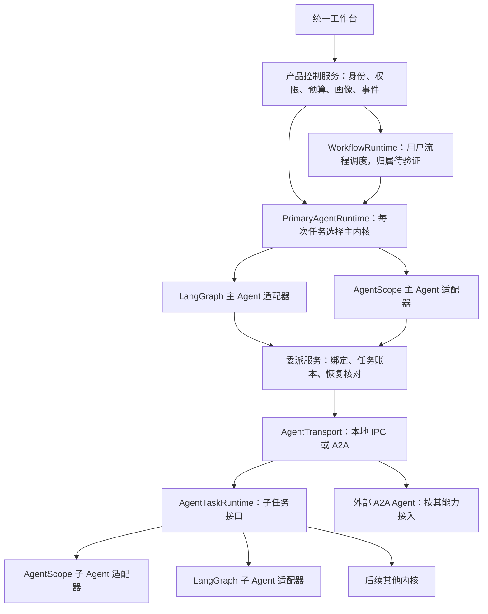

# 双主内核适配、父子 Agent 与 A2A

[返回设计入口](../00-discovery-summary.md) · 上一步：[核心对象](03-core-contracts.md) · 下一步：[工作流与轨迹](04-workflow-and-trace.md)

日期：2026-09-25；状态：LangGraph 与 AgentScope 均可担任主智能体是已确认需求；接口及工作流归属仍待评审。本页是多内核绑定、通信、切换与兼容规则的唯一详细说明；对象字段仍在[核心对象](03-core-contracts.md)。协议与上游事实见[A2A 证据](../research/10-a2a-interoperability.md)。

## 1. 需求改变了哪项决定

上一版“只接一个 RuntimeAdapter、不同时用两套内核”，以及随后“LangGraph 固定主编排、AgentScope 只做子执行器”的提案均已撤回。**产品必须允许 LangGraph 或 AgentScope 担任一次任务的主智能体。** 主智能体持有用户目标、公开计划、委派与汇合、结果交付及任务状态责任；用户工作流的节点调度由产品层还是两套框架适配器承担，仍需对照实验决定。一个执行步骤仍须只有一个明确的状态与重试负责人。

需要分别支持三种操作：

| 操作 | 面向用户的目标 | 产品的处理方式 |
| --- | --- | --- |
| 为新任务切换主内核 | LangGraph 与 AgentScope 均可成为根任务；对话、流程、产物与历史入口一致 | 选择满足主任务 ExecutionProfile 的绑定，运行开始后固定版本；关键共同能力缺失不能宣称切换已完成 |
| 父子使用不同内核 | 两个方向都能看到一个父任务和可展开的子任务 | 通过统一委派服务提交，记录父子身份；各内核管理自己的局部状态 |
| 从旧进度换内核继续 | 已完成的业务结果尽量保留 | 在声明可移植的交接点生成新运行；原内核 checkpoint 不强行翻译 |

“无感”承诺的是两种受管理主内核的必需操作、正常使用路径和数据呈现一致。回答内容、速度、费用、框架内部回溯粒度仍可能不同；外部 Agent 的取消能力也须按实测展示。涉及必需能力不足、出网目的地变化或不可安全迁移时，必须展示具体影响，不能为了隐藏技术差异而伪报成功。

## 2. 中间层区分主 Agent、工作流、子任务和传输

| 接口 | 提供什么 | 不能假定什么 |
| --- | --- | --- |
| PrimaryAgentRuntime | 创建顶层任务、接收目标、公开计划、委派/汇合、状态观察、补充输入、取消与恢复；继承任务执行的共同语义 | 把 AgentScope 藏在 LangGraph 根图的子节点里，就算 AgentScope 已担任主智能体 |
| WorkflowRuntime | 验证并调度 WorkflowDefinition、观察节点与执行状态；按能力提供 checkpoint/resume/history/fork | 主智能体绑定 AgentScope 时，工作流必然只能由 LangGraph 调度；或两套框架天然有相同图语义 |
| AgentTaskRuntime | capabilities、submit、inspect、events、provide_input、request_cancel；可选 checkpoint/fork/导出交接数据 | 一个 invoke 返回值足以表达长任务、待补充输入、结果未知和取消竞争 |
| AgentTransport | 将同一任务契约通过受控本地 IPC 或 A2A 送到执行端，完成认证与协议转换 | 换通信协议能补齐执行器没有的能力，或直接搬走其内存状态 |

这些都是产品内部接口名，尚未实现正式 SDK。PrimaryAgentRuntime 是具备顶层计划、委派与汇合能力的 AgentTaskRuntime；同一框架可以实现两种角色，也可另提供 WorkflowRuntime。`RuntimeBinding` 指定主 Agent、流程调度及每个子任务的实现。UI、业务工具和存储只依赖产品契约，不持有 LangGraph StateGraph 或 AgentScope AgentState。主 Agent 使用 AgentScope 时，不能仍由隐藏的 LangGraph 主任务代替它作计划与委派。

不建设 N×N 的“LangGraph 转 AgentScope / AgentScope 转其他框架”转换器。每个适配器转换到同一组规范消息、任务、产物和事件；框架内部的 prompt 组织、缓存、reducer、循环变量和 SDK 对象留在适配器内部。

**不要只统一最低能力。** 主任务必需操作形成共同契约：计划、工具、委派、恢复、公开轨迹、用户流程节点级分叉与结果交付。框架内部任意一步分叉、内部事件和硬取消等更细粒度能力单独探测。工作流声明必要能力；两个主绑定都未通过共同验收前，不能声称实现了双主内核 MVP。缺口须解释，不能静默砍掉用户需要的步骤。

## 3. 能力档位与兼容预检

ExecutionProfile 同时声明输入/输出 schema、必需操作、可见性、恢复粒度、允许位置和预算约束。下面的名称是拟议的产品档位，不是 A2A 标准：

| 档位 | 约束 | 可用场景 |
| --- | --- | --- |
| Task Basic | 消息/产物 schema、身份、公开任务状态、错误可映射；取消能力如实标明 | 接入仅返回任务结果的外部 Agent |
| Managed Task | 产品可控制的工具/模型出口、共享预算、持久委派关系、公开事件和恢复核对 | 受管理的本地多内核父子任务 |
| Primary Managed | 在 Managed Task 之上负责根任务的计划、委派/汇合、输入补充、恢复和结果交付 | LangGraph、AgentScope 两种可切换主智能体 |
| Workflow Durable | 进一步通过固定流程编译、检查点恢复、产品声明的节点分叉/版本检查 | 用户画布可执行工作流；归属路线待验证 |

注册时记录声明能力，运行前用合成 conformance tests 核验；unknown 不视为支持。能力随 runtime/adapter/protocol/工具版本固定，升级重新验证。Agent Card 的自述不等于已通过测试或拥有本地权限。

兼容预检输出三类结果：可执行；需明确的转换/降级；不兼容。例：只接受文字的执行器不能无提示丢图片；不支持内部 fork 的子任务可以从委派边界重新执行为新任务，但按钮必须写“重新执行子任务”，不能写“恢复子任务内部节点”。要求完整内部轨迹的流程不能自动改用仅提供最终结果的外部 Agent。若受管理主内核缺少必需的产品流程节点分叉，预检应明确失败并阻止宣称双主 MVP 达标。

K1 的共同验收必须包含 LangGraph、AgentScope 两种 PrimaryAgentRuntime 绑定，并让同一用户流程在两种主绑定下通过 Workflow Durable 的产品可见检查。工作流可以由独立产品层调度，也可以由两套框架适配器调度；此项取舍要在 K0 双主实验后评审。**仅有两种子任务执行器或单向父子委派，不满足双主需求。** AgentScope 目前未通过历史节点分叉的发布包实验；须补机制并验收，不能以能力预检失败作为最终交付。

## 4. A2A 用在什么边界

建议跨进程的父子 Agent 使用 A2A 作为标准通信选择。LangGraph 主→AgentScope 子已有单向合成实验；AgentScope 主→LangGraph 子是下一独立门槛。同进程可用更轻的调用方式，但必须通过同一产品任务契约，不能绕过权限、预算和事件服务。A2A consumer 接入外部 Agent；A2A provider wrapper 把受管理的本地执行器暴露成任务服务，两个方向分别验收。

A2A 负责能力发现、消息、任务生命周期和产物交换；MCP 继续承接工具/资源调用。A2A AgentSkill 是能力描述，不能当作本地 SKILL.md 包自动下载执行。父子关系、项目隔离、业务证据、预算租约、全轨迹和内核检查点仍由产品管理，不因使用 A2A 自动获得。[官方协议与固定版本](../research/10-a2a-interoperability.md)

### 4.1 映射规则

下表使用 A2A 1.0 状态语义；具体 SDK 命名和 wire 字段由锁定版本适配。

| A2A 对象或状态 | 产品映射 | 容易错的地方 |
| --- | --- | --- |
| AgentCard / 支持的接口与版本 | 能力声明及 endpoint 身份，经信任校验后注册 | 描述文本不能授予访问权限；变化要重新核验 |
| Message / Parts | Message 的规范内容块与转换记录 | text、raw、url、structured data 分别处理，不将 JSON 字符串当已验证结构化产物 |
| taskId / contextId / messageId | 按远端主体和运行绑定命名空间，关联 DelegationRecord | contextId 不是租户/权限凭据；不同项目默认不复用远端 context |
| submitted / working | queued / running | 本地超时不自动将远端改为 failed |
| input-required | waiting_for_input，并保存待答问题和 continuation 关联 | 回复流结束不等于整个任务完成 |
| auth-required | waiting_for_auth；按受信任认证路径处理 | 不把主 Agent 密钥写进消息、metadata 或转发给子 Agent |
| completed | 远端执行结束，再校验产物 | 远端完成不等于业务结果被接受或已发布 |
| rejected / failed / canceled | 分别记录原终态及本地解释 | 拒绝执行、失败、取消和“用户不采纳结果”是不同概念 |
| unknown / 不认识的状态 | reconciliation_required，停止依赖结果的后续动作 | 不猜成完成，不盲重试 |
| Artifact 更新 | 校验后导入本地不可变产物；保留远端来源与版本关系 | 远端可变 URL、append 片段不直接等于完整本地文件 |
| 无任务的直接 Message | 记录一次消息交换的完成 | 不虚构远端 taskId、检查点或可取消长任务 |

产品自己的状态范围可大于 A2A，例如 cancel_requested、transport_disconnected、reconciliation_required。原始远端状态与本地状态都保存，不能用一个框架的“reply completed”覆盖它们。

产物 URL 通过受控下载代理解析，限制协议、目的地、重定向、大小和类型；不允许返回的 file URL 读取宿主任意路径。把本地路径传给远端也不能让其自动读取文件：应使用经授权的有界内容或受控传输引用，并校验哈希。交接图片/表格时保留类型和来源；无法无损转换须可见。

### 4.2 不由 A2A 自动保证的行为

A2A 可以让内部工具、记忆和执行过程保持不透明；标准任务交互不等于工作流节点 checkpoint/fork。发送消息的幂等不能无条件假设；重新订阅不等于补齐所有历史事件；取消需确认最终结果。具体依据在[协议证据](../research/10-a2a-interoperability.md)，这些差异必须进入能力档位。

如需产品完整事件和预算协作，可协商一个有版本的产品扩展，由自有 wrapper 实现。扩展标识/schema 待正式契约阶段固定；metadata 里的自报字段不作为安全凭据。必需扩展缺失时拒绝对应档位，可选扩展缺失时只开放真实具备的能力。外部服务没有本扩展，仍可作为 Task Basic 接入。

## 5. 两种主内核怎样委派子 Agent

1. 顶层任务明确选择 LangGraph 或 AgentScope 为 PrimaryAgentRuntime；流程节点和子 Agent 引用稳定 agent_id 与 ExecutionProfile，再解析为各自固定的 RuntimeBinding。模型选择与内核选择是两项配置，不能混为同一个路由。
2. 主智能体经同一委派服务创建 DelegationRecord，预留父预算，记录参数哈希、父 attempt、工具与数据授权的子集，再提交。两种内核可运行在独立环境以处理依赖冲突；独立进程本身仍不是执行沙盒。
3. 受管理的 A2A wrapper 校验调用主体与任务范围，创建子任务，映射 Task、Message、Artifact 和公开事件。子内核管理其内部循环；主智能体负责子任务选择与结果整合，流程调度器负责已定义节点的顺序和状态。重试权属要固定，不能让两层各自无界重试。
4. 收到 input-required 时，主任务展示同一套补充信息界面；用户回答送回已绑定子任务。暂停后不重复创建子任务。
5. 父进程退出后，从持久账本找回已存在的子 task，先 GetTask/重新订阅并核对，再决定继续等待、补输入或收集结果。子服务不可达显示状态未知，不能当作没有运行。
6. 子任务完成后，验收产物、结算预算，写回主任务或对应流程节点。项目及全局画像都通过产品 MemoryStore 提交候选，失败、取消和未选定分支不直接写入；子 Agent 不能绕过更新规则或扩大工具权限。外部服务自己的记忆保留与删除政策另外核验，产品不替其承诺可遗忘。

标准 A2A 终态任务不能重新开启。修改需求、换内核或重跑已结束的子任务，创建新任务并保留 lineage；不修改原 task。[官方任务生命周期](https://a2a-protocol.org/latest/topics/life-of-a-task/)

### 5.1 提交结果未知与取消竞争

最危险的窗口是“子服务已接受，父进程还没保存 taskId”。仅有本地 request_id 或 messageId 不足以证明远端去重。受管理 wrapper 应将调用主体、delegation_id、请求内容哈希与远端 taskId 持久绑定，以相同请求重试返回同一任务；同 key 不同内容拒绝。去重登记、子任务创建和待调度记录应在服务端原子提交后才开始执行；崩溃恢复继续认领同一个任务，不能在登记落盘前产生副作用。受管理 wrapper 的进程重启、并发重复以及“接收/登记/开始执行”之间的故障窗口都需验收；本轮混合调用实验不代表这一整套事务协议已实现。

不支持这种契约的外部服务，提交超时后进入核对状态；不得自动重发有副作用的任务。已保存 taskId 的恢复查询，与首次提交未知是不同测试场景。业务副作用仍使用[工作流的 EffectIntent 规则](04-workflow-and-trace.md#4-点击历史节点后的操作)。

取消先记录 cancel_requested，再传播给子任务。收到成功/取消/失败终态后核对；取消不支持、请求丢失、执行已完成或效果未知分别展示。父节点失去租约后发回的迟到结果可留存，但不能越过当前分支的选择规则发布；通过原子状态版本/fencing 避免旧 attempt 覆盖新结果。

用调用身份关联父级预留和子级用量，同一账单不重复计费；取消后的迟到用量继续结算，未知费用不记零。对于受管理运行时，可以在模型/工具代理处强制限制预算。对无法控制内部调用的外部 Agent，只能声明委派预算、截止时间和接收策略；若对方无法承诺上限，就不能显示“已强制限制所有费用”。

## 6. 内核切换与状态可移植性

| 数据或状态 | 切换策略 |
| --- | --- |
| 用户会话、规范消息、已保存产物、项目画像与来源 | 由产品持有，普通切换保持入口和读取行为；仍按权限与删除规则展示 |
| 产品 WorkflowDefinition | 在支持相同节点/profile 的编排器上重新编译；kernel-specific 节点必须替换或声明不可移植 |
| 内核原生 checkpoint、reducer 状态、迭代栈、供应商 continuation | 固定 runtime/adapter/schema 版本，仅承诺原内核兼容恢复；不直接转为另一内核 |
| 可移植 HandoffSnapshot | 在声明的业务交接点导出已完成输入输出、未完成目标与依赖；校验后在目标内核新建后续运行 |
| 在途工具/代码进程、尚未核对的外部写入 | 先结束、取消或核对；不在效果未知时热切换 |

主内核切换对新运行生效。在途运行继续绑定旧内核；升级/卸载前提示依赖它的未完成任务，并按保留、停止或交接策略处理。安全策略撤销后即使有旧 runtime 也不能恢复被禁止的动作。

交接快照传递业务状态和允许使用的上下文，不包含密钥、隐藏推理或伪造的原生检查点。目标内核重新校验工具、模型、授权、输入哈希、画像版本和预算，产生新 run/branch 并关联来源。结果可不同，记录转换损失。若用户要求从任意内核任意内部节点热迁移，这超出本轮可保证范围，需逐个编写并验证迁移器。

旧内核不可用时，历史事件与产物仍由产品读取；继续执行则明确需要兼容运行时或从安全交接点重启。可读历史与可恢复执行分别验收。

## 7. 用户看到什么

任务页统一展示计划、进度、待答问题、产物和分支。用户可在新任务开始前选择主内核，也可保存常用选择；需要时再为子 Agent 指定绑定。普通使用者无需操作框架对象或 A2A taskId。

轨迹有两个维度：产品自身事件是否完整，以及远端内部过程是否提供。受管理本地 Agent 可上传规范节点事件；普通外部 A2A Agent 至少展示已观察的请求、状态、结果和来源，内部细节标为“此服务未提供”。断流后的快照恢复若无法补齐事件，记录覆盖缺口，不制造完整过程。

从轨迹点击“重跑”时按实际粒度给操作：原内核节点分叉、重新执行整个子任务，或从可移植交接点建立新尝试。用户不需要理解框架名称，但必须知道将重算哪些步骤、是否再次收费和可能产生哪些副作用。

## 8. 分期与验收

本轮已有固定版本协议研究与 10 项单向合成互通检查；结果见[实验 README](../../research/spikes/runtime-interoperability/README.md)。**该实验仅覆盖 LangGraph 主→AgentScope 子，不能代表双主内核已经实现。** 阶段范围以[产品需求](../product/01-product-brief.md#分期建议)为准。

| 阶段 | 验收目标 |
| --- | --- |
| K0a 当前 | 双主需求和共同验收线写入设计；旧默认主内核提案撤回 |
| K0b 下一实验 | AgentScope 独立主运行；AgentScope 主→LangGraph 子 A2A；产品可见节点分叉的能力缺口单独记录 |
| K0c 评审 | 比较产品持有工作流调度与双 WorkflowRuntime 适配两条路线，依据实测确定实现分工 |
| K1a / K1b | 两种主内核分别通过固定流程，再通过同一界面的可编辑流程、轨迹、历史节点分叉及权限预算验收 |

必须覆盖的反例：等待输入被误标完成；图片或结构化 Parts 被丢弃；无 fork 能力却显示节点恢复；接受请求后 taskId 回执丢失；同一 delegation 并发重复；不同项目复用 context；断流遗漏事件；取消与完成竞争；旧 runtime 被卸载；权限撤销后继续旧任务；外部任务耗费未知。每项注明通过、失败或未测，不用“接通 A2A”代替以上验收。
